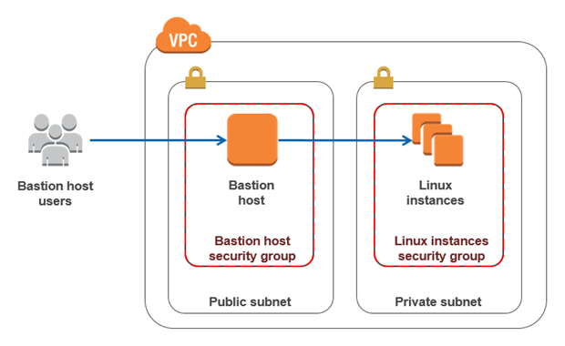

Acme Architecture
==

Acme company is a Home video broadcasting system need service design implementation that
resilency and scalable

### Cloud provider

Amazon AWS is provide cloud infrastructure. Acme services base on **Symphony** php framework that use 
Mysql base we decide to use Amazon RDS that offer **replication across region** and they provide
decdicate bandwidth for back-bone replication.
 

## Orchrestration

* Kubernetes, We use Kubernetes because we can deploy our services as Container as services.

* Kubernetes also provide Dashboard for monitoring and management. Also can plug with notification system as we need.

* Amazon AWS we can deploy cluster across zone and regions as need. 


Resource usage control and scaling
===

### Auto Scaler 

If a service is resource intensive and a service needs to be low latency we can scale when CPU met 80%


```kubectl autoscale deployment php-apache --cpu-percent=80 --min=1 --max=10```

However is next gen architecture pattern but currently Acme services not design to support this we not mention here. 

**_NOTE k8s only support Autoscaler by CPU and custom metrics for timebase_**

### Rate limit

* When Acme services need to limit user access to service such as ```/kitty2019``` we use rate-limit to control
with ```ingress-nginx annotation``` [ingress-nginx-annotation](https://kubernetes.github.io/ingress-nginx/user-guide/nginx-configuration/annotations/)

* This is security feature prevent people burst a lot of traffic to our site and we don't need that. 

## Access control to service by GeoIP.

if parts of a service need to be restricted to certain geographical boundaries 
this can be done by Kubernetes with ```ingress-nginx``` we will use GeoIP module to solve this.  

For GeoIP access control to Acme services to archive you need to custom template ( little :-)). follow by this guide.


```bash

http {
    #...
    geoip_country GeoIP/GeoIP.dat;
    geoip_city    GeoIP/GeoLiteCity.dat;
    #...
 }
... . 

geoip_country /usr/share/geoip/GeoIP.dat;
 map $geoip_country_code $allow_country {
 default yes;
 EG no;
 FR no;
 FI no;

}

```


```bash

location /serviceA {

  if ($allow_country = no) {
   return 403;
   
   # For gentle and better user experience should redirect to announce service.
   # return 301 https://acmecompany.com/restriction-announce 
  }     
}

``` 

* When Acme company services were popular. For better user experience we can use Amazon DNS routing via GeoIP lead our
user get contain from nearest server. Or customize what we need.


 


### Improvement


Previous system Acme company use Nginx caching for their web static + Video media and proxy for all services.
their capcacity can serve around 10,000 - 20,000 concurrent ( Maximum 35,000 concurrent ).


This service service for short lenght of Video (2MB) ( clip ) with m4.2xlarge ( 8vCPU,Ram 32GB ) instances type.


Significant limitation, because Acme system also provide services with HTTPS. HTTPS is CPU intensive even
Administrator well tuning SSL parameter on Nginx. That will burn-down with  a lot of user when they watching they favorite media and movies. 

Acme system can't survive over 15min. when user burst of traffic to watch their favorite media. Also have
 a lot of cost must paid for the bandwidth usage from server side.


 
#### Peer to Peer Video

We suggest peer to peer cdn for video services. Instead that provide single-source to serving
Video medias. User just loading from CDN when watching , next one who watching they well serve
from peer-to-peer instead. This will reduce a mount of your server and bandwidth cost. It's good choice. 


## Monitoring. 

Rest of infrastructure we can monitoring through Kubernetes dashboard. 


##### Monitoring Imcoming Traffic


##### Monitoring Process and Resource


##### Alert and Notification.

Our Acme kubernetes combined with Prometheus and Grafana. 


## Trouble shooting

When web-site slow down. 

* from client site we must check for TTFB return.
* from Administrator can check network latency from server side to last hop client.
* from server side Administrator can check from monitoring metric ( prometheus & grafana
dashboard)

for TTFB monitoring can be use opensource software like https://github.com/chrissnell/crabby
or custom prometheus , or curl 

```$bash

# You can use bash script with below snippet use with Zabbix etc.
 curl -s -o /dev/null -w "Connect: %{time_connect} TTFB: %{time_starttransfer} Total time: %{time_total} \n" https://www.example.com/ |grep Connect

# result
Connect: 0.210134 TTFB: 0.877657 Total time: 0.877814 

```


## Accessing 

Amazon AWS provide VPN service for secure access service. Optional we give one small ec2 instance.
to provide access private services behind this host call **Bastion Host**



```$bash

#gen key 

ssh-keygen -b 2048 -t rsa -f ./acme_gateway -q -N ""


Host private1
  IdentityFile ~/.ssh/host_behind_thedoor_private_key
  ProxyCommand ssh user@bastion -W %h:%p

Host bastion
  IdentityFile ~/.ssh/acme_gateway


```

## More access control. 

Acme company have special policy that want to control regular user to access system log file
under ```/var/log/*``` with read-only permission. 

```$bash

useradd logview

setfact -Rdm u:logview:r /var/log
setfacl -Rm u:logview:r /var/log

# Test

su logview 
 
logview$ less /var/log/audit/audit.log

```


If we want more control you can look Mandatory Access Control ( MAC ) to fine grain security. 
 


## Tips

#### Bash file to grep IPV4 form file

* File named ```find-ip.sh``` 
* Test file ```test.echo```

**_NOTE: this limitation of bash script when IP string are concatenate result is un-expected._**

```$bash

#!/bin/bash
while IFS='' read -r line || [[ -n "$line" ]]; do
      echo $line | grep -o -E "(25[0-5]|2[0-4][0-9]|[01]?[0-9][0-9]?)\.(25[0-5]|2[0-4][0-9]|[01]?[0-9][0-9]?)\.(25[0-5]|2[0-4][0-9]|[01]?[0-9][0-9]?)\.(25[0-5]|2[0-4][0-9]|[01]?[0-9][0-9]?)" 
      done < "$1"


```
##### Test
```$bash

chmod +x find-ip.sh

./find-ip.sh test.echo

# ... 
10.226.1.43
192.168.1.7


```


#### reference

* Picture in this README copy from Internet. 
* https://github.com/kubernetes/contrib/tree/master/ingress/controllers/nginx/examples/custom-template
* https://aws.amazon.com/ec2/instance-types/
* https://kubernetes.io/docs/tasks/run-application/horizontal-pod-autoscale/#support-for-horizontal-pod-autoscaler-in-kubectl
* https://kubernetes.github.io/ingress-nginx/user-guide/nginx-configuration/annotations/


 


  

